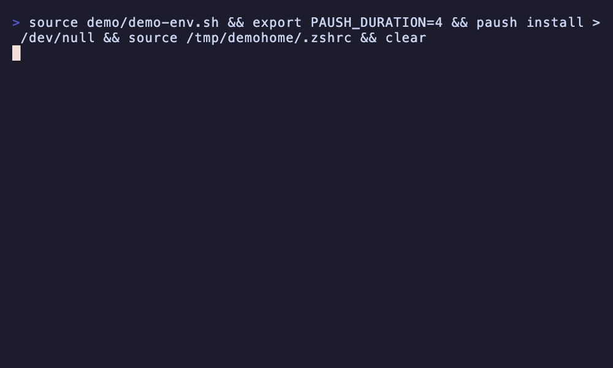

# paush

A two-second mindfulness break in your terminal. Run it, breathe in, breathe out, carry on.



Every run generates a unique ASCII breathing animation that fills your terminal: a random shape (circle, diamond, square, flower, or starburst), motion (expand, ripple, fill, spiral, or pulse ring), character gradient, and color. The animation plays on the alternate screen, so your terminal is left exactly as it was when the break ends.

## Install

```sh
make build
```

## Usage

```sh
paush
```

That's it. One second in, one second out.

Longer breaks stretch the breath — half the duration in, half out:

```sh
paush -t 8              # one deep 4s-in/4s-out breath
export PAUSH_DURATION=8 # same, for every run; -t overrides it
```

## Typo aliases

```sh
paush install
```

Adds aliases for common command typos (`sl`, `gti`, `cta`, `dri`, `grpe`,
`suod`, `pyhton`, `dokcer`, ...) to your `~/.zshrc` or `~/.bashrc`. Mistype a
command and you get a breathing break instead of an error — arguments are
ignored, so `gti status` breathes too. The block is marked, reinstall is
idempotent, and `paush uninstall` removes it.

## Cross-compiling

```sh
make release
```

Builds stripped static binaries for macOS, Linux, and Windows (amd64 and arm64) into `dist/`.

Requires a terminal with ANSI escape support (any modern terminal, including Windows Terminal).
